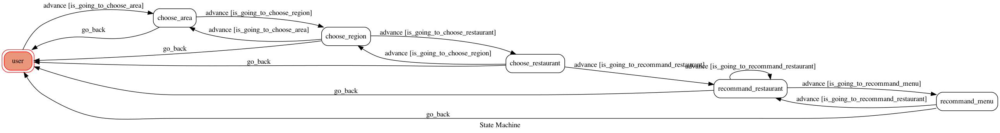

# FOODRABBIT

## Setup

* for pipenv
```sh
pip3 install pipenv

pipenv --three

pipenv install

pipenv shell
```

* for visualizing Finite State Machine
```sh
pipenv install transitions

pipenv install graphviz
```


* for crawler
```sh
pipenv install beautifulsoup4
```
### Secret Data
You should generate a `.env` file to set Environment Variables.
`LINE_CHANNEL_SECRET` and `LINE_CHANNEL_ACCESS_TOKEN` **MUST** be set to proper values.
Otherwise, you might not be able to run your code.

### Run the sever

```sh
python3 app.py
```

## Finite State Machine


### state 說明
* `user`：輸入aneater，開始使用
* `choose_area`：選擇一個區域
* `choose_region`：選擇一個城市
* `choose_restaurant`：選擇推薦餐廳
* `recommand_restaurant`：選擇前往訂餐，或是快速瀏覽菜單
* `recommand_menu`：顯示餐廳菜單

## 使用範例


## Deploy
Setting to deploy webhooks on Heroku.

### Heroku CLI installation

* [macOS, Windows](https://devcenter.heroku.com/articles/heroku-cli)


### Connect to Heroku

1. Register Heroku: https://signup.heroku.com

2. Create Heroku project from website

3. CLI Login

	`heroku login`

### Upload project to Heroku

1. Add local project to Heroku project

	heroku git:remote -a {HEROKU_APP_NAME}

2. Upload project

	```
	git add .
	git commit -m "Add code"
	git push -f heroku master
	```

3. Set Environment - Line Messaging API Secret Keys

	```
	heroku config:set LINE_CHANNEL_SECRET=your_line_channel_secret
	heroku config:set LINE_CHANNEL_ACCESS_TOKEN=your_line_channel_access_token
	```

4. Your Project is now running on Heroku!

	url: `{HEROKU_APP_NAME}.herokuapp.com/callback`

	debug command: `heroku logs --tail --app {HEROKU_APP_NAME}`

5. If fail with `pygraphviz` install errors

	run commands below can solve the problems
	```
	heroku buildpacks:set heroku/python
	heroku buildpacks:add --index 1 heroku-community/apt
	```

